# RESPONSI MODUL 2

# Membaca gambar `background.png` dan menampilkan (gambar dan shape) 
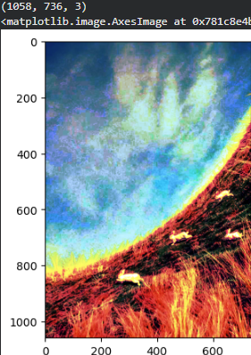

---
# Memecah gambar menjadi tiga channel terpisah: Red, Green, dan Blue
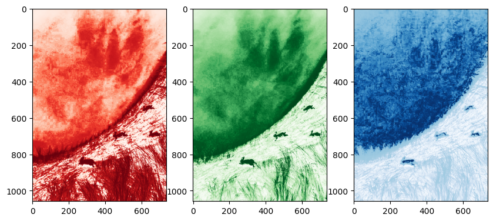

---
# Menampilkan histogram setiap channel secara individu untuk melihat distribusi intensitas warna dasar
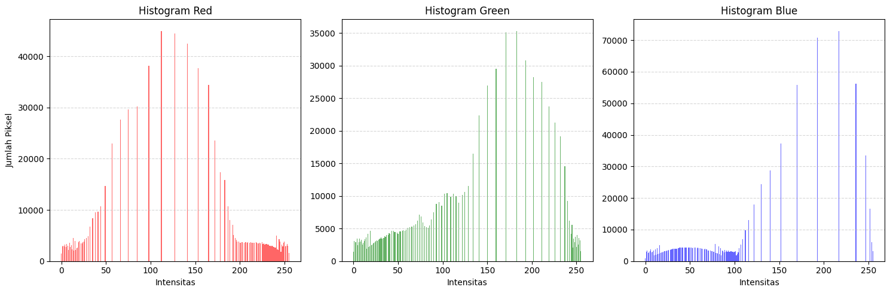

---
# Membaca gambar target `red_target.png`, `green_target.png`, `blue_target.png` dan menampilkannya hasil grayscale
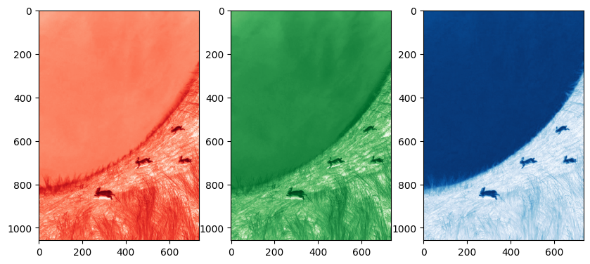

---
# Menampilkan histogram setiap channel gambar target untuk melihat distribusi intensitas warna dasar
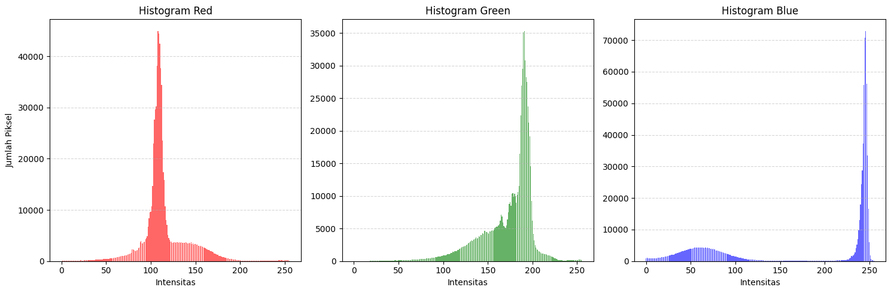

---
# Melakukan spesifikasi pada setiap channel pada gambar `background.png` terhadap gambar target dengan ketentuan channel `red` dengan `red_target.png`, `green` dengan `green_target.png`, `blue` dengan `blue_target.png` . Serta menampilkan gambar hasil spesifikasi dan histogramnya
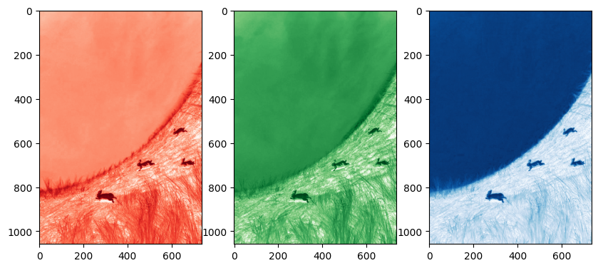

---

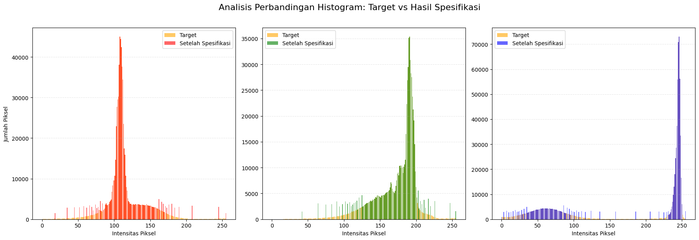
---

# Menggabungkan semua channel hasil spesifikasi menjadi satu gambar utuh dan menampilkan gambar awal `background.png` dan hasil spesifikasi. Lakukan analisis terhadap pengaruh spesifikasi

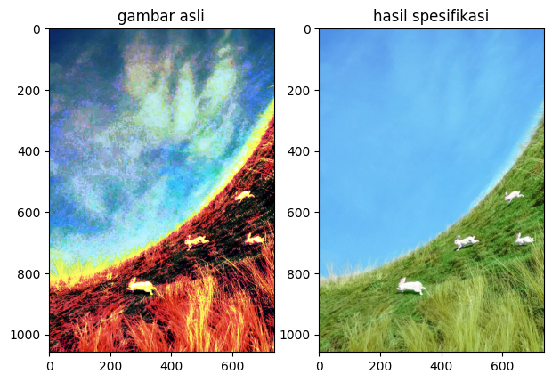

---

# Membaca dan menampilkan gambar `foreground.png` (gambar dan shape).

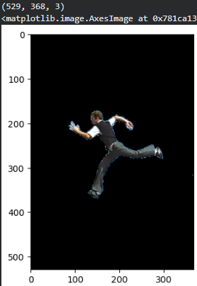

---

# Sebelum melakukan penjumlahan perhatikan shape dari gambar `hasil spesifikasi` dan  `foreground.png`. Lakukan salah satu operasi Transformasi Geometri pada gambar `foreground.png` agar memiliki shape yang sama dengan gambar `hasil spesifikasi`. 
note: lakukan operasi transformasi geometri pada tiap channel `foreground.png` dan gabungkan semua channel. `tanpa menggunakan fungsi resize`

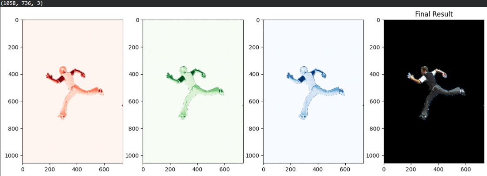

---

# Setelah shapenya sama gambar hasil spesifikasi dan gambar foreground (hasil operasi transformasi geometri) kemudian digabungkan menggunakan `fungsi penjumlahan` dengan logika kondisional:
- Jika piksel pada foreground memiliki nilai intensitas (bukan hitam), maka piksel tersebut yang digunakan.  
- Jika tidak, maka piksel diambil dari citra background hasil spesifikasi.

Hasilnya adalah sebuah citra komposit di mana objek foreground berada di atas latar belakang yang kontrasnya telah disesuaikan.

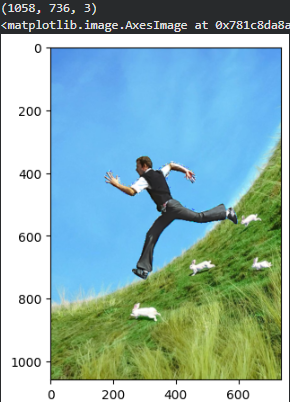

---
# Tahap akhir melibatkan pembagian citra komposit menjadi tiga bagian secara vertikal: bagian kiri, tengah, dan kanan.

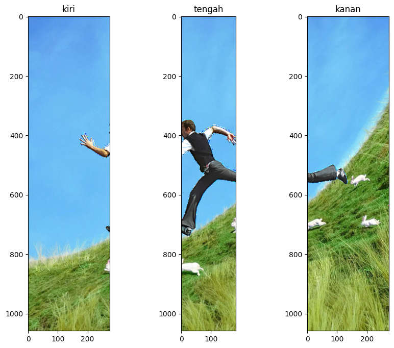

---

# Tampilkan histogram untuk gambar bagian tengah saja

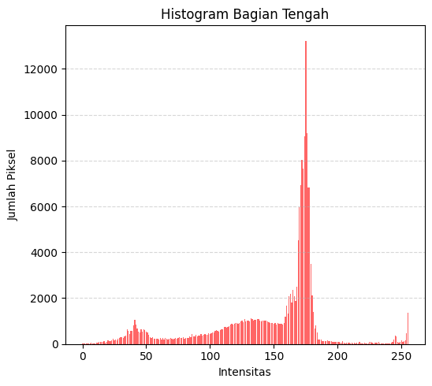

---

# Khusus pada bagian tengah, lakukan proses Ekualisasi Histogram pada tiap channel untuk meratakan distribusi intensitas agar kontrasnya meningkat secara otomatis. Tampilkan hasil gambar dan histogramnya. Lakukan analisis atas pengaruh proses ekualisasi pada gambar

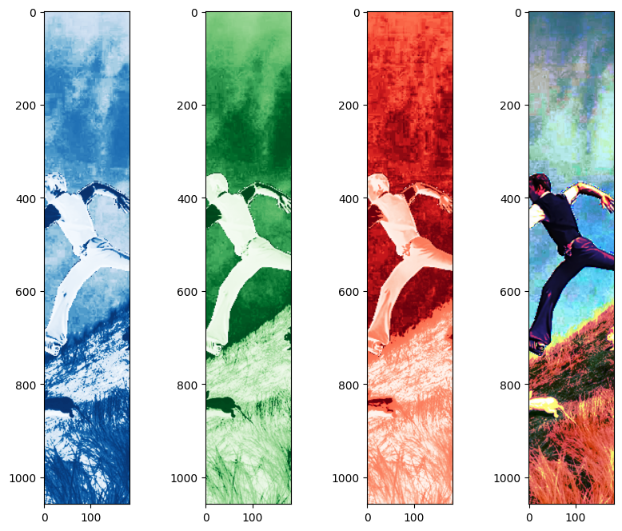

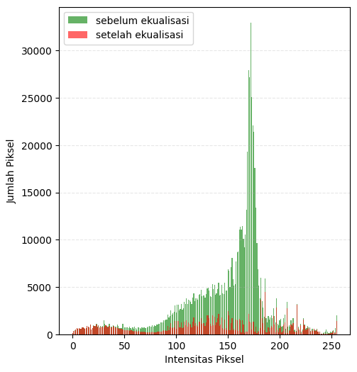

---

# Setelah itu, ketiga bagian tersebut disatukan kembali menjadi satu citra utuh (`bagian kiri`, `bagian tengah hasil ekualisasi`, `bagian kanan`).

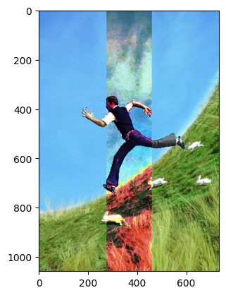

---
# Berikan kesimpulan dari semua proses yang dilakukan